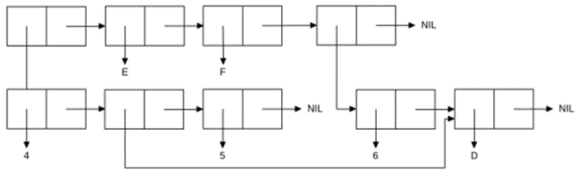

# fp_lab1
<p align="center"><b>МОНУ НТУУ КПІ ім. Ігоря Сікорського ФПМ СПіСКС</b></p>
<p align="center">
<b>Звіт з лабораторної роботи 1</b><br/>
"Обробка списків з використанням базових функцій"<br/>
дисципліни "Вступ до функціонального програмування"
</p>
<p align="right"><b>Студентка</b>:Зубенко Марія Олексіївна КВ-11</p>
<p align="right"><b>Рік</b>: 2024</p>

## Загальне завдання
Створіть список з п'яти елементів, використовуючи функції LIST і CONS . Форма створення списку має бути одна — використання SET чи SETQ (або інших допоміжних форм) для збереження проміжних значень не допускається. Загальна кількість елементів (включно з підсписками та їх елементами) не має перевищувати 10-12 шт. (дуже великий список робити не потрібно). Збережіть створений список у якусь змінну з SET або SETQ . Список має містити (напряму або у підсписках):
хоча б один символ
хоча б одне число
хоча б один не пустий підсписок
хоча б один пустий підсписок
Отримайте голову списку.
Отримайте хвіст списку.
Отримайте третій елемент списку.
Отримайте останній елемент списку.
Використайте предикати ATOM та LISTP на різних елементах списку (по 2-3 приклади для кожної функції).
Використайте на елементах списку 2-3 інших предикати з розглянутих у розділі 4 навчального посібника.
Об'єднайте створений список з одним із його непустих підсписків. Для цього використайте функцію APPEND.

```lisp
;;Step 1
(defvar my-list nil)
(setq my-list (list 'c 2 (list 2 4) () 'b))
(format t "~a~%" my-list)

;;Step 2
(format t "~a~%" (first my-list))

;;Step 3
(format t "~a~%" (cdr my-list))

;;Step 4
(format t "~a~%" (nth 2 my-list))

;;Step 5
(format t "~a~%" (last my-list))

;;Step 6
(format t "ATOM for first elem: ~a~%" (atom (first my-list)))
(format t "ATOM for second elem: ~a~%" (atom (nth 1 my-list)))
(format t "ATOM for fourth elem ~a~%" (atom (nth 3 my-list)))
(format t "LISTP for first elem: " (listp (first my-list)))
(format t "LISTP for third elem: ~a~%" (listp (nth 2 my-list)))
(format t "LISTP for fifth elem: ~a~%" (listp (nth 5 my-list)))

;;Step 7
(format t "equal for second and fourth elem: ~a~%" (equal (nth 1 my-list) (nth 3 my-list)))
(format t "Chech is second zero ~a~%" (zerop (nth 1 my-list)))

;;Step 8
(defvar sublist (nth 2 my-list))
(defvar merged-list (append my-list sublist))
(format t "Merged list ~a~%" merged-list)
```
## Результати тестування
```lisp
(C 2 (2 4) NIL B)
C
(2 (2 4) NIL B)
(2 4)
(B)
ATOM for first elem: T
ATOM for second elem: T
ATOM for fourth elem T
LISTP for first elem: LISTP for third elem: T
LISTP for fifth elem: T
equal for second and fourth elem: NIL
Chech is second zero NIL
Merged list (C 2 (2 4) NIL B 2 4)
```
## Варіант 8
<p align="center">

</p>
```lisp
(defvar eight-list nil)
(defvar include-in-list nil)
(setq include-in-list '(d) eight-list (list (list 4 include-in-list 5) 'e 'f (cons 6 include-in-list)))
(print eight-list)
```
## Результати тестування
```lisp
((4 (D) 5) E F (6 D)) 
```
